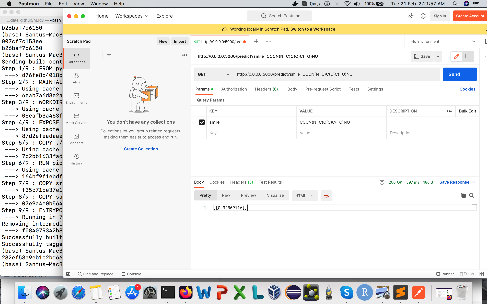

# hERG
A robust predictor for hERG channel blockade based on deep learning meta-features
# hERG

### **Task:**

*   [x] **Prepare the data for modelling in active learning fashion in Jupyter Notebook**
*   [x] **Choose data representation**
*   [x] **Build starting model**
*   [x] **Decide upon active learning strategy and apply it to improve your model**
*   [x] **Decide when to stop labelling new data in lab as labelling compounds via lab experiments isalways additional cost**

Second task is to prepare model for production by serving the model as API and package into Docker.

*   [x] **Organising the code**
*   [x] **Building the REST API** --- using [Flask](https://palletsprojects.com/p/flask/)
*   [ ] **Wrapping served model into Docker**
*   [x] **Testing** --- using [PyTest](https://docs.pytest.org/en/7.2.x/getting-started.html)
*   [x] **Logging** --- using [gunicorn](https://gunicorn.org/)
*   [x] **Load testing of deployed model inference** --- using [Locust](https://locust.io/)

## Docker Run:

* Step 1: git clone https://github.com/santuchal/hERG.git
* Step 2: cd hERG
* Step 3: Build docker image using: docker image build -t flask_docker .
* Step 4: Run newly created docker container: docker run -p 5000:5000 -d flask_docker
* Step 5: Open testing API open [Postman](https://www.postman.com/)
* Step 6: Chek URL http://0.0.0.0:5000/ 
* Step 7: Stop all container: docker stop $(docker ps -a -q)

## Testing:

Install pytest. Go to the root directory and run pytest. 
It'll automatically test the routes. 

## Logging: 
Install gunicorn and check the logging for user. 

## Load Testing:
Install locust and go to the test/locustfiles. 
Run locust open your browser and go to the url http://0.0.0.0:8089 then spawn and check your results. 

Additionally, for checking you can check locust_test_results/report_1676873675.420206.html .

### Completion Screen Shot

* Please check the first completion image 

* Please check the second completion image 